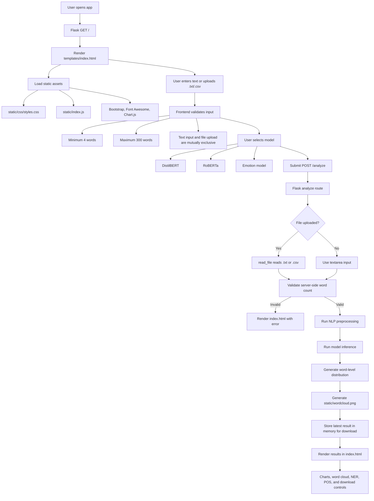
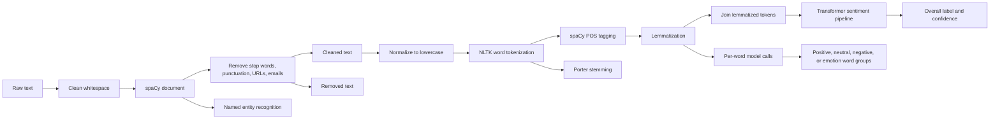
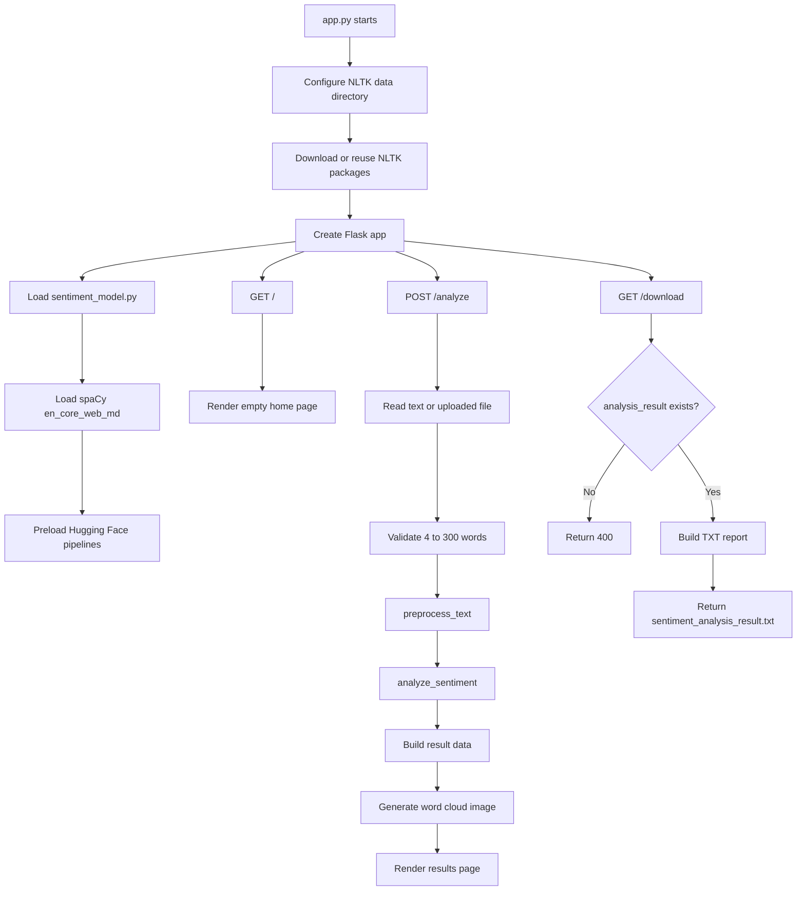
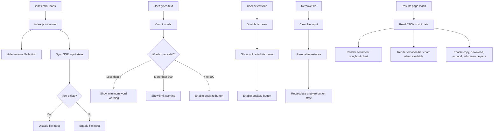

# Project Workflow

This document describes the runtime workflow for the IntelliNLP sentiment analysis Flask project.

## High-level application flow

## NLP analysis pipeline

## Backend route flow

## Frontend interaction flow

## Main files and responsibilities

| File | Responsibility |
| --- | --- |
| `app.py` | Flask routes, validation, word cloud generation, download response |
| `sentiment_model.py` | spaCy and Transformer model loading, preprocessing, file reading, sentiment inference |
| `templates/index.html` | Main page markup, Jinja rendering, results layout, embedded JSON for charts |
| `static/index.js` | Form interactions, validation state, charts, copy/download/expand helpers |
| `static/css/styles.css` | Application styling |
| `static/wordcloud.png` | Generated word cloud output |

## Notes

- The `/analyze` route stores the latest analysis in the global `analysis_result` variable for download during the current app session.
- The `/download` route returns the most recent analysis result as `sentiment_analysis_result.txt`.
- `static/wordcloud.png` is overwritten each time a new valid analysis runs.
